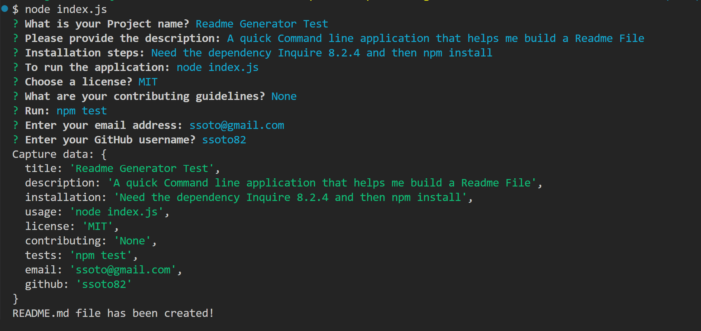

# Readme-Generator
## Description

The README Generator is a Command-line application developed with Node.js and the Inquirer package. This will dynamically generate a professional `README.md` file based on user input. It streamlines the process of creating a well structured README file, making easier for developers to document their projects efficiently.

## Installation
Inquirer@8.2.4 
npm install

## Usage
To use the README Generator, execute the following command in your terminal: 
node index.js

You will be prompted to provide various details about your project.

## Prompts
You will be asked for:

* Project Name
* Description
* Installation 
* Usage
* License Options
* Contributing Guidelines
* Tests
* Your Email
* Your GitHub username

## Reporting Issues
If you encounter any issues with the README Generator, please open an issue or contact ssoto@gmail.com. 
GitHub repo link https://github.com/ssoto83/Readme-Generator.git

## Contributing
Contributions are welcome to improve the README Generator. 

## License
This project is licensed under the MIT license.

## Sample Application Video

https://watch.screencastify.com/v/3POLf4zWYlkSZfA5J2dR
